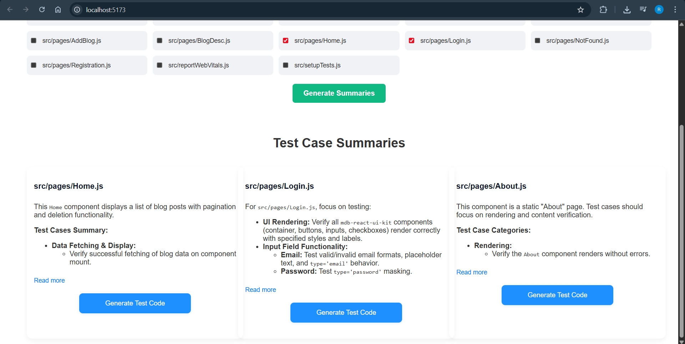
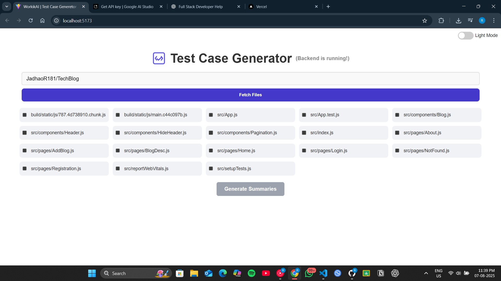
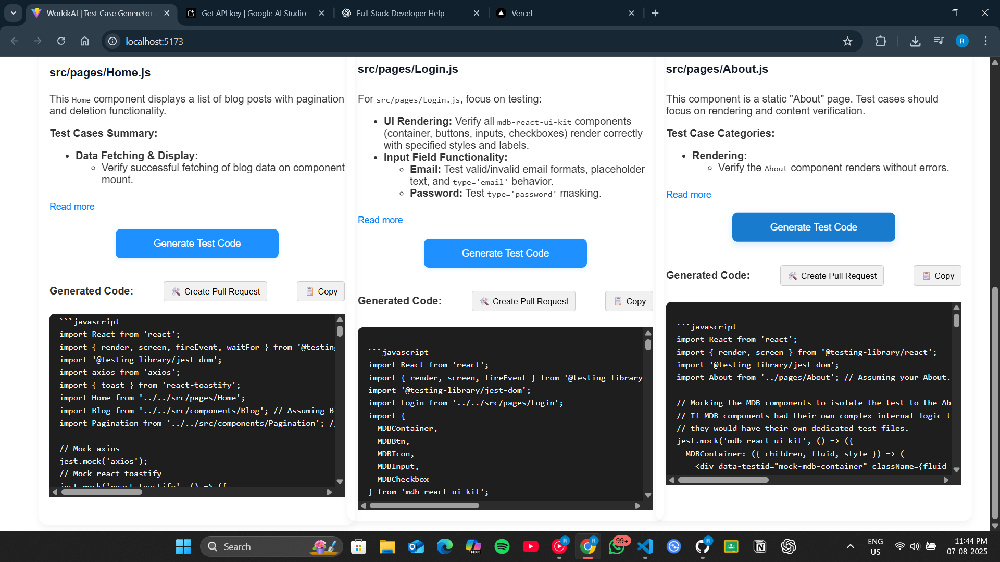

# 🧪 Test Case Generator Application with GitHub Integration

This is a full-stack web application that generates AI-based test case suggestions and code from your codebase, and optionally creates a Pull Request (PR) to your GitHub repository with the generated tests.

> 🚀 Built as part of an internship assignment for a Full Stack Developer position at **Workik AI**.

---

## 📌 Features

- 🔍 **GitHub Integration** – Fetches code files from a selected GitHub repository.
- 🤖 **AI-Powered Test Case Generation** – Suggests intelligent test case summaries using the Gemini AI model.
- 🧑‍💻 **Test Code Generation** – Generates actual test code for selected summaries.
- 📂 **Pull Request Automation** – Automatically creates a branch, commits the test file, and opens a PR to your repo.
- 💡 **Clean & Responsive UI** – Modern React frontend with smooth dropdowns, loaders, and scrollable containers.

---

## ⚙️ Tech Stack

| Layer       | Technology                      |
|------------|----------------------------------|
| Frontend    | React.js (Vite)                 |
| Backend     | FastAPI (Python)                |
| AI API      | Gemini 2.5 Flash-Lite           |
| GitHub API  | GitHub REST API v3              |

---
# 🖼️ UI Preview

## 📸 Screenshots

### 🏠 Home Page


### 🧪 Generated Test Summary


### ✍️ Create PR Flow


## 🎥 Demo Video

🔗 [Click here to watch the demo video](https://drive.google.com/file/d/YOUR_FILE_ID/view)

---

## 🚀 Getting Started (Local Development)

### 1. Clone the Repository

```bash
git clone https://github.com/your-username/test-case-generator-app.git
cd test-case-generator-app
```

### 2. Setup Backend (FastAPI)

```bash
cd backend
python -m venv venv
venv\Scripts\activate on Windows
pip install -r requirements.txt
```

Create a `.env` file in the `backend/` directory with:

```
GITHUB_ACCESS_TOKEN=your_pat_here
GITHUB_USERNAME=your_username
TARGET_REPO_NAME=your_repo
TARGET_REPO_OWNER=your_username
GEMINI_API_KEY=your_gemini_api_key
```

Run backend server:

```bash
uvicorn main:app --reload --port 8000
```

---

### 3. Setup Frontend (React)

```bash
cd ../frontend
npm install
npm run dev
```

---

**Make sure to:**
- Never expose `.env` or access tokens in public commits
- Add `.env`, `node_modules`, and `__pycache__` to `.gitignore`

---

## 🧠 Why This Project?

As a final-year IT Engineering student, I built this project not just as an internship assignment, but to:

- Showcase my **end-to-end full stack development skills**
- Work with **AI APIs and GitHub automation**
- Build a **real-world dev tool** that saves time for developers
- Strengthen my understanding of **React, Python (FastAPI), REST APIs**, and deployment

---

## 📁 Project Structure

```
test-case-generator-app/
│
├── backend/         # FastAPI server
│   ├── main.py
│   ├── requirements.txt
│   └── .env
│
├── frontend/        # React frontend
│   ├── src/
│   ├── public/
│   ├── App.jsx
│   └── vite.config.js
│
└── README.md
```

---

## 🤝 Acknowledgements

- [Workik AI](https://www.workik.com) – Internship opportunity & assignment
- [Google Gemini](https://deepmind.google/technologies/gemini/) – AI for test generation
- [GitHub REST API](https://docs.github.com/en/rest) – PR automation

---

## 📬 Contact

**Ravindra Jadhav**  
📧 Email: jadhaor181@gmail.com  
🌐 Portfolio: [https://ravindra-portfolio-vite.vercel.app]( https://ravindra-portfolio-vite.vercel.app/)  
💼 LinkedIn: [linkedin.com/in/ravindrajadhav08](https://www.linkedin.com/in/ravindrajadhav08/)
